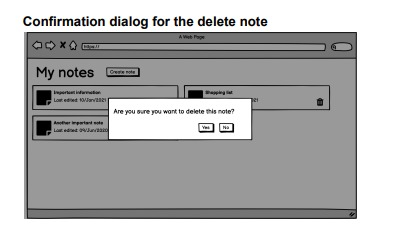

Implementation exercise

1. Requirements / Intro
   You need to implement a simple web application that allows you to take notes, tag and filter them. The
   development is divided in two phases:

- Phase 1: note creation
- Phase 2: tag application and filtering
  IMPORTANT CONSIDERATIONS:
- Phase 1 is mandatory to pass this exercise, while Phase 2 will provide extra points if done.
- Content should be persisted in a relational database by using an ORM - in-memory
  storage or mocks are not allowed.

2. Deliverables
   To pass this exercise, in addition to the implementation, you must

- Upload the code to a private GitHub repository given by Ensolvers HR staff and use git
  properly. Both the frontend and the backend should be pushed to that repository, in
  folders named backend and frontend respectively.
- Include a bash / zsh script allowing to run the app - ideally, the app should start in a
  Linux/macOS environment just running one command. This command should set up
  everything that is required to run the app like, for instance, setting up a DB schema,
  pre-creating any config file, etc.
- Include a README.md file describing all the runtimes, engines, tools etc. required to run the
  app, with their concrete versions - for instance, MySQL 5.7, Spring Boot 2.1, React 16.10, etc.

3. Technologies
   There is no restriction about the technology to be used, if the implementation satisfies the
   following:

- Structure the app as a Single Page web Application, i.e. frontend and backend are different
  apps. That is the general case when you use React, Angular, Vue.js or any other similar UI
  framework. Please consider that rendering a web page on the server-side (by using JSP, EJS,
  Smarty, Blade, etc.) but using a bit of JS to, for instance, fetch some data, is not a pure SPA.
  You need to implement an isolated app, in a separate folder, with its custom package.json
  and dependencies.
- The backend app exposes a REST API that is the way in which the frontend app
  communicates with the backend
- The backend app is separated into layers (e.g., Controllers, Services, DAOs/Repositories,
  etc.). It is important to mention that Laravel (PHP) and Django (Python) DO NOT
  SUPPORT that layer separation by default when building apps, so if you submit a
  backend done directly with those technologies without any further adjustment in the
  architecture, it might probably need to be improved or the exercise will be rejected
  directly. On the other hand, Spring Boot (Java) and Nestjs (Node.js) are two technologies
  that enforce and/or ease the use of this layer separation. For more information, you can check
  the definition of the Service Layer pattern and an example in Spring Boot

4. User Stories and mockups
   Phase 1
   User Stories

- As a user, I want to be able to create, edit and delete notes
- As a user, I want to archive/unarchive notes
- As a user, I want to list both my active notes
- As a user, I want to list both my archived notes
  Mockups for active and archived notes
  NOTE: these mockups are for reference purposes only, different variants of user interface can be
  accepted if they match the desired functionality as described in the user stories.

    

    

Phase 2
User stories

- As a user, I want to be able to add/remove categories to notes
- As a user, I want to be able to filter notes by category
  Mockups
  
   

5. Extra functional and non-functional requirements
   These features will provide EXTRA POINTS to your exercise results if done

- Login: If you provide a login screen that allows users to log in and out from the app - you
  need to document the default user/password used in README.md.
- Live deployed version: If you deploy the app (for instance via Heroku) and you share the
  URL of the live running version.
